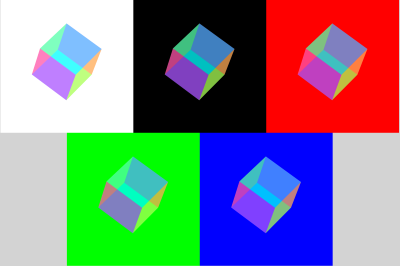

### CMY Cubes

Being fascinated by the toy I've seen in videos: a clear, hand-held cube where each side is tinted with cyan, magenta, or yellow (subtractive primary colors), I decided to create something similar with pure CSS.

I decided to go a bit further and include an animation of the cube spinning back and forth. I also repeated the cube over multiple backgrounds: white, black, and the additive primaries: red, green, and blue.

The screenshot doesn't quite do it justice, so I recommend you look at the site in it's full glory. It's quite mesmorizing!

### Hosting

This site is currently hosted on github pages at https://psikai.github.io/cmyk-cubes/
